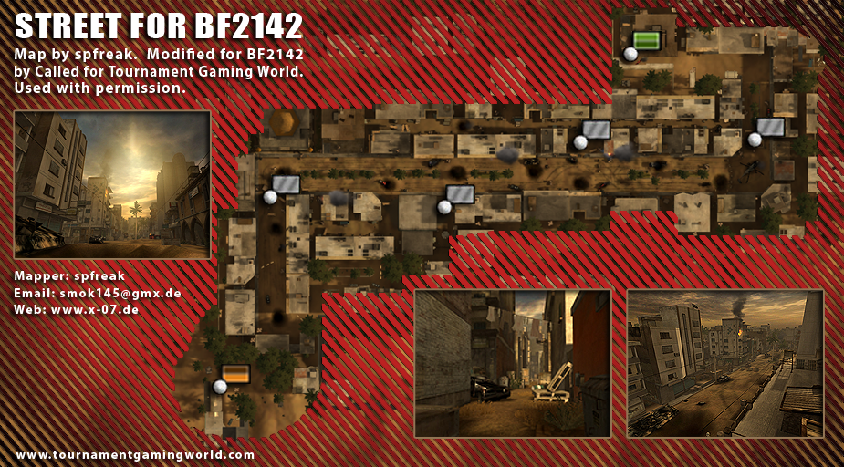
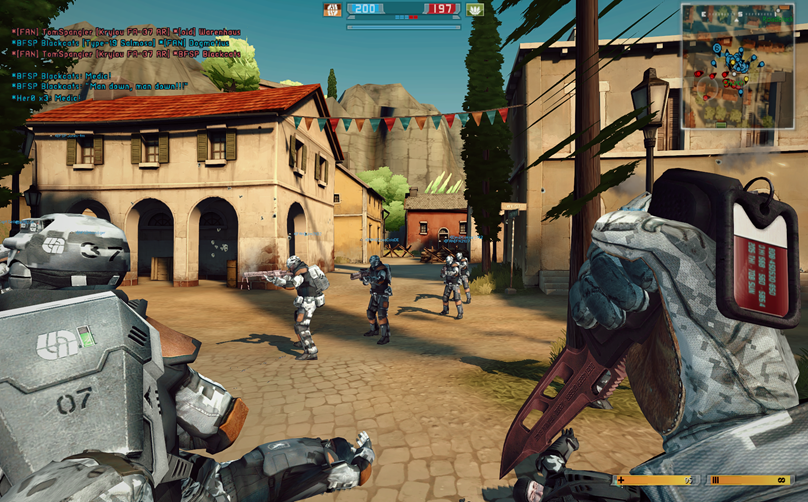
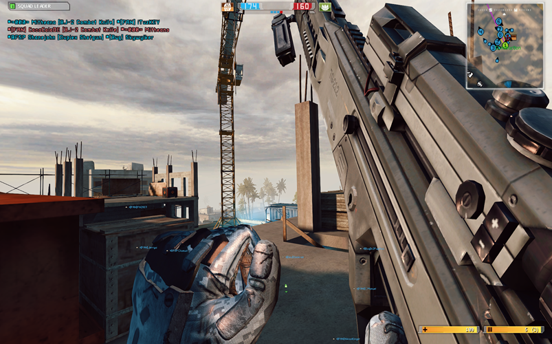

# Extra Maps w/ Bot Support

If you’re a Battlefield fan who loves playing with bots, you’ve probably noticed that the standard map selection can get old fast. A lot of us wish there were more vanilla maps with bot support — or even the chance to play classic BF2 or 1942 maps in BF2142. Maybe you’re looking for maps loaded with vehicles, or ones designed just for epic walker or tank battles. In this guide, I’ll show you where to find these custom maps and share some top recommendations to help you build the ultimate collection.

My top picks for the best BF2142 map addons

**This is just my personal take...**

* `Belgrade` offers street fighting that isn’t too intense, with plenty of open areas.
* `Fall of Berlin` delivers classic street battles in Berlin with a great atmosphere.
* `Camp Gibraltar` is all about close-quarters combat — perfect for shotgun and assault fans.
* `Bridge at Remagen` is my pick for the best snow map for street fighting.
* `Breakthrough at Remagen` is ideal for sniping, with some medium-sized open spaces in a snowy setting.
* `Strike at Karkand` brings that BF2 nostalgic, linear Middle Eastern street fighting vibe.
* `Desert Storm` feels a lot like BF1’s Sinai Desert — an open map with hills, perfect for tank and walker battles, and a paradise for engineers.
* `Victory Village` is a European town map focused on street fighting.
* `Street` is another linear Middle Eastern map, great for street battles.
* `Suez Canal` is a sniper’s dream, with a linear layout that really suits long-range play.

**How to get the maps?**

* You can get Belgrade, Fall of Berlin, and Camp Gibraltar through either the [Remaster Mod](../getting-started/download-and-install-remaster-mod.md) or [BF2142 Hub](../getting-started/apply-openspy-patches.md).
* To access Bridge at Remagen, Breakthrough at Remagen, and Strike at Karkand, you’ll need the [Remaster Mod](../getting-started/download-and-install-remaster-mod.md).
* For our improved versions of Desert Storm, Victory Village, and Street — with fixes for broken bot support — you can download them [here](extra-maps-w-bot-support.md#what-you-will-get-from-us).

## What we got with Vanilla ...

You got just 5 maps with bot support for singleplayer and multiplayer.

List of Maps in Vanilla BF2142 w/ Bot Support

* Belgrade - 16

- Cerbere Landing - 16

* Fall of Berlin - 16

- Suez Canal - 16

* Verdun - 16

## What you will get with Remaster Mod ...

You'll get a long list of maps with bot support for both singleplayer and multiplayer.

You’ll get smarter AI, upgraded textures, and better balancing tweaks on these maps.&#x20;

You’ll also find bot support added to more vanilla maps, plus support for different map sizes and layouts. There’s even partial bot support for the Titan map in the 48-player layout.

List of Maps in Remaster Mod w/ Bot Support

#### Core Maps:

* Belgrade - 16/32/64
* Cerbere Landing - 16/32/64
* Fall of Berlin - 16/32
* Suez Canal - 16/32/48/64
* Verdun - 16/32/48/64
* Minsk - 16/32/48/64
* Tunis Harbor - 16/32/64
* Camp Gibraltar - 16/32/64
* Shuhia Taiba - 16/32/48/64
* Sidi Power Plant - 16/32/48/64
* \[BF2] Highway Tampa - 16/32/48/64 \[...[^1]]

#### v1.50 Maps

* \[BF2] Wake Island 2142 - 64 \[...][^2]
* Operation Shingle - 16/32/64

#### v1.51 Maps

* Molokai - 16/32/64
* Yellow Knife - 16/32/64
* \[BF2] Operation Blue Pearl - 16/32/64 \[...[^3]]
* \[BF2] Strike at Karkand - 16/32/48/64 \[...[^4]]

#### Northern Strike Maps:

* Bridge at Remagen - 16/32/64
* Leipzig - 16/32/64
* Port Bavaria Day - 16/32/64 \[...[^5]]
* Port Bavaria Night - 16/32/64 \[...[^5]]
* Breakthrough at Remagen - 16/32/64 \[...[^6]]

#### Custom Maps:

* \[BF2] Backstab - 16/32/64 \[...[^7]]
* Test Range - 16 \[...[^8]]

Interested? Click [here](../getting-started/download-and-install-remaster-mod.md) to download and install the Remaster Mod.

## What you will get with BF2142 Hub ...

From the many maps available in the Reclamation Map Pack, only a handful support bots.

If you’re looking to play new maps with bots in singleplayer or multiplayer, here are some recommendations to get you started.

List of Maps in Reclamation Map Pack w/ Bot Support

Core Maps (with \_coop suffix):

* Belgrade
* Camp Gibraltar
* Cerbere Landing
* Fall of Berlin
* Highway Tampa
* Liberation of Leipzig

- Operation Shingle
- Shuhia Taiba
- Sidi Power Plant
- Suez Canal
- Verdun
- Minsk
- Hamburg Harbour - 16/32

Custom Maps:

* Desert Storm - 16

- German Camp - 64

* \[BF1942] Kursk - 16

- Severnaya - 16

* \[BF2] Street - 16
* 2142 Shipment - 16

Broken Maps (broken bot support):

* \[BF2] tgw operation amos - 16

- \[BF2] tgw sharqi peninsula - 16

* \[BF Heroes] Victory Village - 16

- \[BF2] Wall of Jericho (Great Wall) - 32/64

Click [here](https://www.battlefield2142.co/maps/v3.html) for more details about the maps in the pack.

You should have BF2142 Hub installed. If you don't, click [here](../getting-started/download-and-install-bf2142-hub.md) to download and install it.

Check out [this guide](../getting-started/apply-openspy-patches.md#installing-individual-maps) to learn how to install individual maps from the Reclamation Map Pack instead of downloading the entire pack.

## What you will get from us ...

You’ll get a few maps from the Reclamation Map Pack that we’ve fixed or tweaked for a better experience.

Street

<figure><figcaption></figcaption></figure>

Street is a ...

What has been changed?

* Tweaked ticket ratio: 200tk for 16
* Removed ghost car (broken object) found on the street that will get people easily stuck
* Renamed control points, spawn points for better

Full credits go to spfreak from TGW who ported the map from BF2 to BF2142.&#x20;

The original version is available in Reclamation Map Pack.

Desert Storm

Victory Village

<figure><figcaption></figcaption></figure>

Victory Village is a famous map in Battlefield: Heroes level. Now it has been fixed to work on vanilla BF2142 with bot support.

[Victory Village 2142](https://www.moddb.com/games/battlefield-2142/addons/na16686) with bot support is first published by [yone](https://www.moddb.com/members/yone) on ModDB. Sadly the map does not load well on newer version and will mostly cause crash instantly when loaded into the map.

[matthysjordaan](https://www.moddb.com/members/matthysjordaan) then published [Victory Village (Fixed)](https://www.moddb.com/addons/victory-village-fixed) based on yone's work on ModDB that loads properly but he dropped bot support.

We combine the 2 version together with some of our tweaks to make this map available again for Conquest Coop.

###

* Tweaked ticket ratio: 200tk for 16
* Fixed bot support
* Removed buggy spawn points that cause bots die instantly
* Removed unnecessary load files
* Made the base of both side uncapaturable, make the 3 control points in the middle uncaptured by default

### Download

Extract the map folder to `.../Battlefield 2142/mods/<MOD>/Levels`.

### Credits

Full credits go to yone and matthysjordaan who ported the map from BFHeroes to BF2142.&#x20;

The original version is available on ModDB and in Reclamation Map Pack.

Sharqi Peninsula

<figure><figcaption></figcaption></figure>

Sharqi Peninsula is a famous map in Battlefield 2. Now it has been fixed to work on vanilla BF2142 with bot support.

Operation Amos

Wall of Jericho

Work in progress

Extract the map folder to `.../Battlefield 2142/mods/<MOD>/Levels`.







[^1]: Highway Tampa is a remake of its Battlefield 2 version. The map mostly retains the original layout but is recreated with BF2142 objects throughout.

[^2]: Wake Island 2142 is a community map based around the continuation of Wake Island map variants in the Battlefield series.

[^3]: Operation Blue Pearl is a remake of its Battlefield 2 version. The map mostly retains the original layout but is recreated with BF2142 objects throughout.

[^4]: Strike at Karkand a remake of its Battlefield 2 version, featuring mostly native BF2 objects along with some BF2142 elements.

[^5]: Port Bavaria comes in both Day and Night versions.

[^6]: Breakthrough at Remagen is a variant of Bridge at Remagen.

[^7]: Backstab is a remake of the BF2MC Backstab map, keeping the original layout but rebuilt with BF2142 objects.

[^8]: Test Range, originally called The Hell, is a map from the Reclamation Map Pack that’s been included just for testing purposes.
