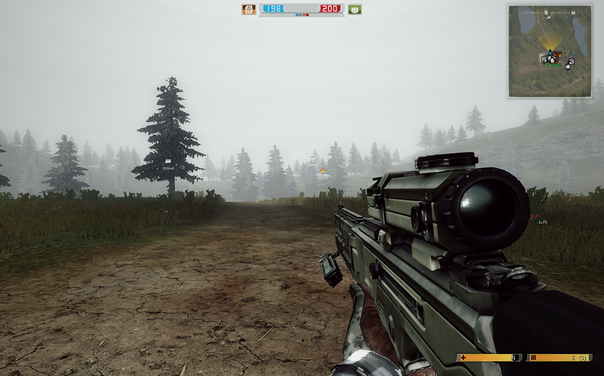
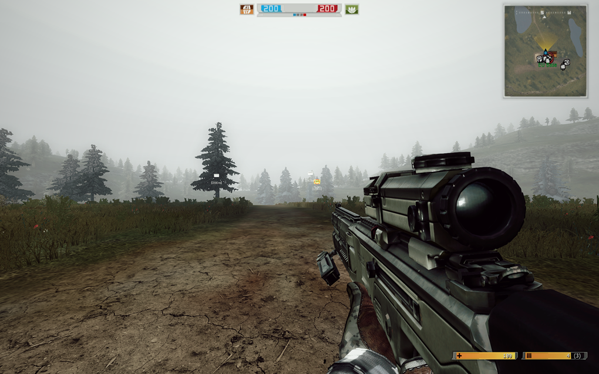

# Field of View (FOV)

Unlike modern Battlefield games, BF2142 doesn’t let you adjust your FOV in-game. Many players find the default field of view too low, so this guide will show you how to change it to whatever you prefer!



<figure><figcaption><p>1.1</p></figcaption></figure>



<figure><figcaption><p>1.5</p></figcaption></figure>



### Preparations

* Do you know where your game directory is? It’s the folder where `BF2142.exe` and `mods` are located. By default, this is usually: `C:\Program Files (x86)\Electronic Arts\Battlefield 2142`.
* You’ll be editing files in `\mods\<MOD>\Objects\Soldiers_server.zip`, so it’s a good idea to make a backup of the file first — just add a suffix like `_bak` or `_o` to the filename of the clone. **\[**[**?**](#user-content-fn-1)[^1]**]**
* If you want this change to affect vanilla BF2142, make your edits in the `\mods\bf2142` folder. Otherwise, edit the files in the `\mods\<MOD>` folder for your chosen mod.

### Procedures



Inside `Soldiers_server.zip`, open the `Common` folder and edit the `SoldierCamera.tweak` file using a text editor.&#x20;

Here are the lines we want to tweak, along with their default values:

```batch
ObjectTemplate.worldFOV 1.1
ObjectTemplate.insideFOV 1.1
```



You can set the value as low as `0.65` to mimic BF P4F’s FOV, or as high as `1.85` for an ultra-wide view  — but keep in mind, the game doesn’t look great with extreme settings.



According to illicitSoul on ModDB, a value of `1.1` gives you about 60-65 FOV, while `1.6` is roughly 90-95 FOV. So, a good starting point is by changing `1.1` to `1.5`.



Save your changes.

If you’re unable to save your changes, try dragging the `.zip` file to your Desktop, make your edits there, and then drag it back when you’re done.



### Acknowledgements

Special thanks to:

* [illicitSoul](https://www.moddb.com/members/ainas) for sharing details on how to modify FOV @ [BF2/BF2142 FOV Modding Tutorial](https://www.moddb.com/tutorials/bf2bf2142-field-of-view-modding-tutorial)

[^1]: That’s because it’s easy to restore the files. You wouldn’t want to go through the hassle of reinstalling the whole game just because something got messed up and you didn’t have a backup.
