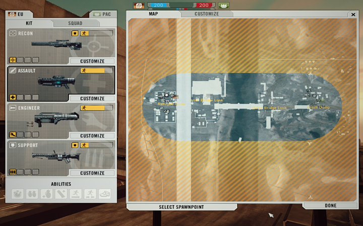
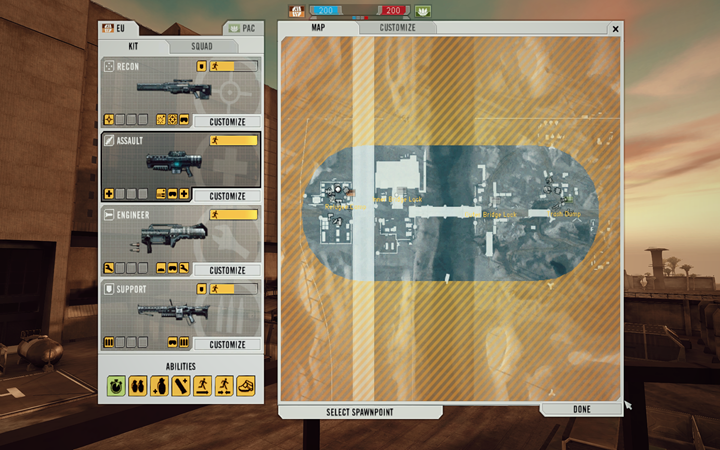

# Widescreen HUD

When BF2142 first launched, it only supported 4:3 displays. Even though the v1.51 patch from EA added native widescreen support (which mostly just stretches the image horizontally), the game’s HUD still looks off on 16:9 resolutions.&#x20;

Thanks to the Project Remaster Team for creating a widescreen HUD fix for BF2142 that properly resizes HUD elements for widescreen displays. This fix is included with the [Project Remaster](../project-remaster/download-and-install-remaster-mod.md) v14 installation, and in this guide, we’ll also show you how to install it if you don’t have the mod.



<figure><figcaption><p>BEFORE: Without Widescreen Hudfix</p></figcaption></figure>



<figure><figcaption><p>AFTER: With Widescreen Hudfix</p></figcaption></figure>



### Preparations

* Do you know where your game directory is? It’s the folder with `BF2142.exe` and your `mods` — by default, usually at `C:\Program Files (x86)\Electronic Arts\Battlefield 2142`.
* If you want the changes for vanilla BF2142, edit the file in `\mods\bf2142`. For a specific mod, edit the file in that mod’s folder instead.

### Procedures

<details>

<summary>If you have Remaster mod installed ...</summary>

To activate Widescreen Hudfix for your Remaster gameplay:

1. Open your <mark style="color:blue;">Remaster Launcher</mark>.
2. Go to the <mark style="color:blue;">Settings</mark> tab.
3. Check both the <mark style="color:blue;">Widescreen Fix</mark> and <mark style="color:blue;">HUD-fix</mark> options. **\[**[**?**](#user-content-fn-1)[^1]**]**
4. That’s all you need to do — you’re good to go! \
   &#xNAN;_(You don't have to follow any steps below.)_

If you ever want to uninstall, simply uncheck those two options. Then, head over to the <mark style="color:blue;">Help</mark> tab and click <mark style="color:blue;">Clear Cache</mark>. That’s it — super simple!

</details>



Download the patch from [Downloads](hudfix.md#downloads).



Extract the two files inside: `Menu_server_hudfix.zip` and `Shaders_client_hudfix.zip`.



Drag and drop both files into your `\mods\<MOD>` folder.



Copy `ClientArchives.con` and rename it to `ClientArchives_o.con` as a backup.

Open `ClientArchives.con` with a text editor.



At the head of the file, add this line **\[**[**?**](#user-content-fn-2)[^2]**]**:

```batch
fileManager.mountArchive Shaders_client_hudfix.zip Shaders
```



Save the file.

If you’re unable to save your changes, try dragging the file to your Desktop, make your edits there, and then drag it back when you’re done.



Copy `ServerArchives.con` and rename it to `ServerArchives_o.con` as a backup.

Open `ServerArchives.con` with a text editor.



At the head of the file, add this line **\[**[**?**](#user-content-fn-3)[^3]**]**:

```batch
fileManager.mountArchive Menu_server_hudfix.zip Menu
```



Save the file.

If you’re unable to save your changes, try dragging the file to your Desktop, make your edits there, and then drag it back when you’re done.



If you launch the game using a shortcut, make sure that `+widescreen 1` is included in the <mark style="color:blue;">Target</mark> field. See [here](https://www.moddb.com/tutorials/how-to-install-and-start-any-bf2142-mod-universal-tutorial-with-pictures) for details.

If you’re using BF2142 Hub, just check the <mark style="color:blue;">TURN ON WIDESCREEN</mark> option.

For Remaster Launcher users, be sure to enable the <mark style="color:blue;">Widescreen fix</mark> in the <mark style="color:blue;">Settings</mark> tab.



And that’s it — you’re all set!



### Downloads



**BF2142 Widescreen Hudfix v2 (15 KB)**





**BF2142 Widescreen Hudfix v1 (9 KB)**





**v2**

* Widescreen support has been added to the Commander screen.
* Components that were previously inaccessible due to the shrunken border are now fixed.



### Remarks

* Revert your changes before joining Reclamation or any multiplayer servers, unless the server explicitly allows or uses this mod.
* If you host a server with this tweak, players who join will also need to make this change.
* To uninstall the fix, simply undo the changes you made.

### Acknowledgements

Special thanks to:

* [Project Remaster Team](https://discord.com/invite/nVdDkgA) for making this fix available
* ompadu for sharing details on how to install the fix on vanilla BF2142 @ [Remaster Discord](https://discord.com/invite/nVdDkgA)


[^1]: **The&#x20;**<mark style="color:blue;">**Widescreen Fix**</mark>**&#x20;adds the widescreen flag to your launch parameters, while the&#x20;**<mark style="color:blue;">**HUD-fix**</mark>**&#x20;makes sure your HUD displays correctly in a 16:9 ratio.**

[^2]: This ensures this line comes before the original `fileManager.mountArchive Shaders_client.zip Shaders` line, so the HUD fix loads first and takes precedence.

[^3]: This ensures this line comes before the original `fileManager.mountArchive Menu_server.zip Menu`  line, so the HUD fix loads first and takes precedence.
