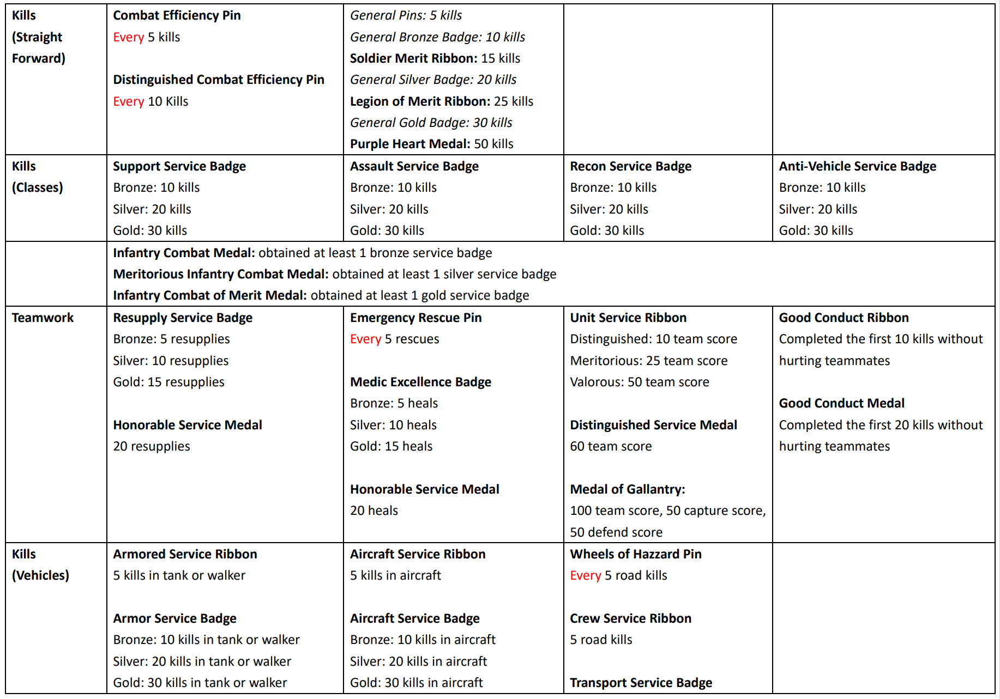
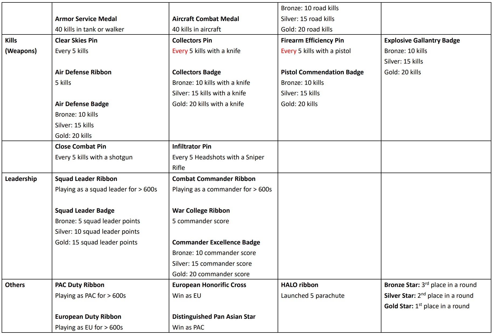

# Offline Rewards

This patch emulates the ranked server rewards system — pins, ribbons, badges, and medals — in your single-player or LAN co-op games. Keep in mind, though, it’s just a simulation: the rewards only last for the current round and will reset once the game ends.

Still, it’s a great quality-of-life improvement that makes bot grinding much more fun. Imagine earning a bunch of medals in one game — it’s pretty satisfying!

### What has been changed ?

Normally, in vanilla BF2142, you wouldn’t really earn medals or badges this way, since many rewards require things like _150 total hours played_ or _300 EU team wi&#x6E;_&#x73; — goals that aren’t possible in a single round. To fix this, we’ve revamped the rewards system and requirements to better fit 15–30 minute co-op games:

* Removed all rewards related to Titan mode.
* Eliminated requirements that are impossible to achieve.
* Simplified many reward requirements, following the hierarchy: Pins → Ribbons → Badges → Medals.
* Most rewards can now be earned in a 15 minute game.



<figure><figcaption></figcaption></figure>



<figure><figcaption></figcaption></figure>



Just a few things to note ...

* To make your games last longer, adjust the ticket ratio when creating a LAN game. \[How?[^1]]
* To enable logging, go to `python\bf2\__init__.py` and adjust the values for `g_debug`, `g_debug_log`, and `g_falog`.
* This patch applies to all mods, including vanilla 2142.

### Downloads



**BF2142\_Offline\_Rewards\_v2.zip (Google Drive, 37 KB)**


Source: [GetBF2142](https://docs.getbf2142.net/) \[Last Verified: July 2025]


**BF2142\_Offline\_Rewards\_v1.zip (Google Drive, 42 KB)**





* Added support to all Remaster mod weapons in `constants.py`
* Made it easier to enable or disable the log functions in `__init__.py`
* Cleaned up some codes in `rank.py` and `unlocks.py`



### Procedures



Download `offline_rewards.zip` from [Downloads](offline-rewards.md#downloads).



Go to the folder where your `BF2142.exe` is located — by default, that’s usually `C:\Program Files (x86)\Electronic Arts\Battlefield 2142`.



In your game directory, find the folder named `python` and rename it to something like `python_o` or `python_backup` to create a backup.



Drag and drop the `python` folder from the `.zip` file into the root directory of your game folder.



<mark style="color:blue;">Overwrite</mark> or <mark style="color:blue;">Replace All</mark> if necessary.



### Acknowledgements

Special thanks to:

* [maiorBoltach](https://github.com/maiorBoltach) for providing the python files (if I'm not mistaken) @ [bf2142stats\_emu](https://github.com/maiorBoltach/bf2142stats_emu)

[^1]: The ticket ratio is a multiplier (e.g., 300 means x3, 350 means x3.5). A value between 200 and 400 is recommended, which will scale your tickets to around 500–1000.
