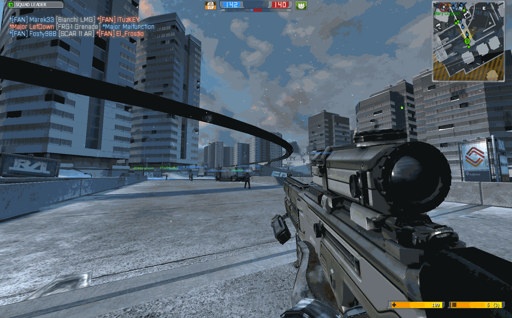
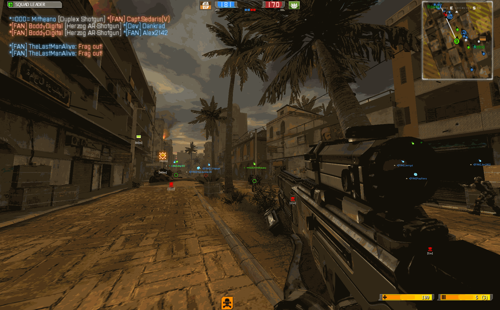

# ReShade & Shaders

Reshade adds a layer of shaders to the game, giving the visuals a big boost. It was first used in Project Reality for BF2 and has since been adapted for BF2142 as well.

The original post about **Reshade for BF2142** by the [Project Remaster Team](https://discord.com/invite/nVdDkgA) is here:&#x20;



However, that version is outdated. The team now uses a newer Reshade client and has updated shader presets. The latest Reshade package for BF2142 is included with the [Project Remaster](../project-remaster/download-and-install-remaster-mod.md) v14 installation. In this guide, we’ll also cover how to install ReShade if you don’t have the mod.



<figure><figcaption>
Breakthrough at Remagen
</figcaption></figure>



<figure><figcaption>
Street
</figcaption></figure>



Just a few things to note:

* ReShade can lower your FPS, so you might see a performance hit.
* ReShade only works on Windows 7 or newer.
* ReShade will apply to all mods, including vanilla 2142.
* ReShade can be easily uninstalled by just deleting the files you added.

### Downloads

**BF2142\_Reshade\_PRv14.zip (Google Drive, 4.2 MB)**


Source: [GetBF2142](https://docs.getbf2142.net/) \[Last Verified: July 2025]


### Installation

If you have Remaster mod installed ...

Activating Reshade is super easy with the mod's launcher, simply:

1. Open your <mark style="color:blue;">Remaster Launcher</mark>.
2. Head to the <mark style="color:blue;">Settings</mark> tab.
3. Check the <mark style="color:blue;">Reshade</mark> option.
4. That’s it — you’re all set!
5. Jump straight to the [Usage](reshade.md#usage) section to see how to use ReShade in-game.\
   &#xNAN;_(You don't have to follow any steps below.)_

To uninstall, just uncheck the <mark style="color:blue;">Reshade</mark> option. It’s that simple!



Download `BF2142_Reshade_PRv14.zip` from [Downloads](reshade.md#downloads).



Extract all the files to the folder where your `BF2142.exe` is located — by default, that’s usually `C:\Program Files (x86)\Electronic Arts\Battlefield 2142`.&#x20;

Overwrite any files.



If you installed the game somewhere other than `C:\Program Files (x86)\Electronic Arts\Battlefield 2142`, you’ll need to manually update all the paths in `d3d9.ini` using a text editor to match your setup.



### Usage



Launch the game.



As soon as you reach the intro or login screen, you’ll notice the visual effect right away.



Press <mark style="color:blue;">Shift + F2</mark> to open ReShade in-game tool. This button lets you toggle the tool on or off.



On the <mark style="color:blue;">Home</mark> tab, check if the preset has loaded — you should see shaders like Levels.fx and Vignette.fx listed.



If the page is empty, the shaders are not loaded yet. You should:

1. Go to the <mark style="color:blue;">Settings</mark> tab and enter the correct paths:
   1. Effect search path: `C:\Program Files (x86)\Electronic Arts\Battlefield 2142\reshade-shaders\Shaders` (or wherever your setup is)
   2. Texture search path: `C:\Program Files (x86)\Electronic Arts\Battlefield 2142\reshade-shaders\Textures` (or wherever your setup is)
2. Then return to the <mark style="color:blue;">Home</mark> tab and click <mark style="color:blue;">Reload</mark>. The preset should load properly now.
3. Also, in the <mark style="color:blue;">Home</mark> tab, check that the preset path in the dropdown menu points to the correct location: `C:\Program Files (x86)\Electronic Arts\Battlefield 2142\DefaultPreset.ini` (or wherever your setup is).



By default, you can toggle the Reshade effect with the <mark style="color:blue;">Scroll Lock</mark> key, but you can change this key bind using the in-game tool. I would recommend setting it to <mark style="color:blue;">Shift + F1</mark>.



If you want to adjust the shaders, just go to the <mark style="color:blue;">Settings</mark> tab and enable <mark style="color:blue;">Configuration Mode</mark>. Then, return to the <mark style="color:blue;">Home</mark> tab to tweak the parameters however you like.



You can create a new preset by clicking the <mark style="color:blue;">+</mark> button next to the dropdown menu in the <mark style="color:blue;">Home</mark> tab. There are two presets **\[**[**?**](#user-content-fn-1)[^1]**]** — `DefaultPreset` and `DefaultPreset2` — that you can select from the dropdown.



If you notice any graphical glitches, try turning off the LUT on certain maps.



### Acknowledgements

Special thanks to:

* [Project Remaster Team](https://discord.com/invite/nVdDkgA) for adapting this excellent shader for BF2142
* [illicitSoul](https://www.moddb.com/members/ainas) for sharing instructions on ReShade setup @ [BF2142 Reshade](https://www.moddb.com/downloads/bf2142-reshade)
* [phale](https://www.moddb.com/members/phale) for sharing details on ReShade setup @ [Heat of Battle Reshade](https://www.moddb.com/mods/heat-of-battle2/downloads/heat-of-battle-reshade-20)

[^1]: For anyone installing the pack from Downloads.
