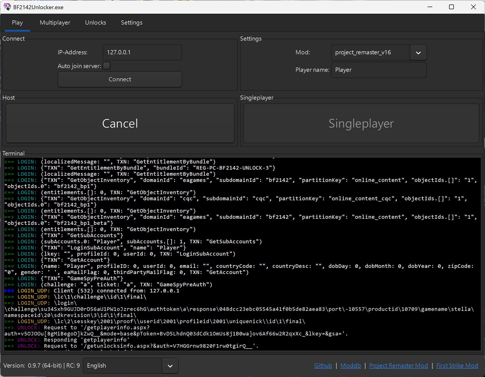
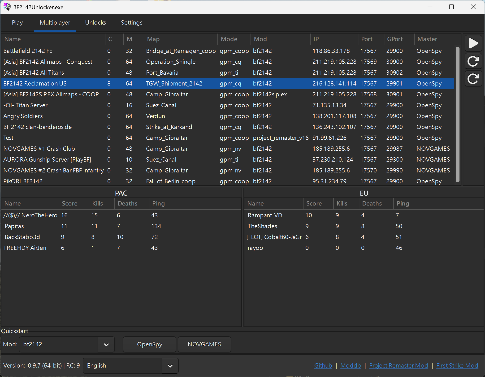

# BF2142Unlocker

Once you’re familiar with the game, you might want to see all server lists, join games quickly, or host your own master server with full unlocks and stats offline. BF2142Unlocker does all this for you — no manual patching needed. Just launch it and use the straightforward interface to join, switch servers, or host games with ease.

<figure><figcaption>
Host Master Server
</figcaption></figure> <figure><figcaption>
Play Multiplayer
</figcaption></figure>



Special Remarks

* With the Unlocker, you’re setting up a master server, but you’ll still need to host the actual game server from within the game itself.

- You can host both your master server and game server even if you’re not connected to any network or don’t have any network adapters.

* <mark style="color:blue;">Host</mark> uses `0.0.0.0` and <mark style="color:blue;">Singleplayer</mark> uses `127.0.0.1`.

### Downloads



**BF2142Unlocker v0.9.7 RC9 - Windows 64-bit (21.31 MB)**


Source: [Dankrad](https://github.com/Dankr4d) @ [BF2142 Remastered](https://discord.gg/nVdDkgA)


**BF2142Unlocker v0.9.7 RC7 - Windows 64-bit (16.78 MB)**





**v0.9.7 RC9**

**Technical Changes**

* Downgraded the programming language (GUI wrapper library is deprecated and no longer compiles with the latest version)
* Fixed installation and build steps in the README
* Updated the build script to include new required GTK shared libraries
* Fixed pointer castings to satisfy stricter C compiler rules

**Consumer Changes**

* Removed PlayBF2142 master server from server.ini (no servers listed there anymore)
* Corrected the OpenSpy master server domain in server.ini (fixes login and account creation in BF2142Unlocker)
* Added “Antialiasing: 2 samples” to BF2142Unlocker settings
* Added functionality to overwrite the hosts string inside the BF2142 executable
  * Note: Battlefield 2142 checks on startup whether the IP it’s connecting to is listed in the hosts file. If it is, the game can crash on startup (black screen). Overwriting the hosts string in the BF2142 executable prevents this crash. Special thanks to @Dennie for the analysis and find!



### Basic Setup

Once you've downloaded the app and lauched it ...


Antivirus tools like Norton may flag some unlocker files as suspicious and quarantine them. Rest assured, the unlocker files are safe. If this happens, restore the files and add the entire unlocker folder to your antivirus exceptions.




**Set the Game Path**

Select your `Battlefield 2142` folder — usually `C:\Program Files (x86)\Electronic Arts\Battlefield 2142`, but it might be different for you.



**Enable LAA-Patch**

This lets the game use up to 4GB of RAM, which helps prevent crashes.



**Use Windowed Mode**

Check the <mark style="color:blue;">Window Mode</mark> option and set your screen resolution.

Only switch to fullscreen once you know everything works — windowed mode makes troubleshooting easier.



**Configure Settings**

Choose the <mark style="color:blue;">Mod</mark> you want to play and set your <mark style="color:blue;">Player name</mark>.&#x20;

Double-check the <mark style="color:blue;">Video</mark>, <mark style="color:blue;">Audio</mark>, and <mark style="color:blue;">HUD</mark> settings — adjust them as needed.



**Host Master Server**

Click <mark style="color:blue;">Host</mark>.



### Windowed Mode Distortion

If the game looks distorted in windowed mode, [enable High DPI Aware](../../help-centre/troubleshoot.md#a01-enable-high-dpi-aware) to fix it.



Go to your `Battlefield 2142` folder.



Right-click each `.exe` (`BF2142.exe`, `BF2142Patched.exe`) → <mark style="color:blue;">Properties</mark> → <mark style="color:blue;">Compatibility</mark> → <mark style="color:blue;">Change high DPI settings</mark>.



Check <mark style="color:blue;">Override high DPI scaling behavior</mark> and set it to <mark style="color:blue;">Application</mark>.



Click <mark style="color:blue;">Apply</mark> and <mark style="color:blue;">OK</mark>.



### Hosting a Server over LAN or WAN

When you use <mark style="color:blue;">Host</mark> in the unlocker, you’re setting up a master server — but you still need to host the actual game server in-game.


Allow `BF2142.exe`, `BF2142Patched.exe` (in the game folder), and `BF2142Unlocker.exe` (in the Unlocker folder) through both Private and Public networks to avoid connection issues.

<mark style="color:blue;">Control Panel</mark> → <mark style="color:blue;">System and Security</mark> → <mark style="color:blue;">Windows Defender Firewall</mark> → <mark style="color:blue;">Allow an app or feature through Windows Defender Firewall</mark>. Add the executables for both network types.




Follow the steps in [Host a server](../../getting-started/host-server.md) to start your game server.

Make sure you read all the expandable notes — don’t skip any!



Share your server’s IPv4 address (local or global, depending on your setup) with anyone joining.



Have players enter your server’s IPv4 address in the Unlocker’s <mark style="color:blue;">IP-Address</mark> box, enable <mark style="color:blue;">Auto join server</mark>, then click <mark style="color:blue;">Connect</mark>.&#x20;

This will connect them to your master server and game server in one go.



### Acknowledgements

Special thanks to

* Dankrad for creating and maintaining BF2142Unlocker @ [BF2142 Remastered](https://discord.com/invite/nVdDkgA)
* Dennie for sharing his findings on the host / singleplayer crash @ [BF2142 Remastered](https://discord.com/invite/nVdDkgA)
