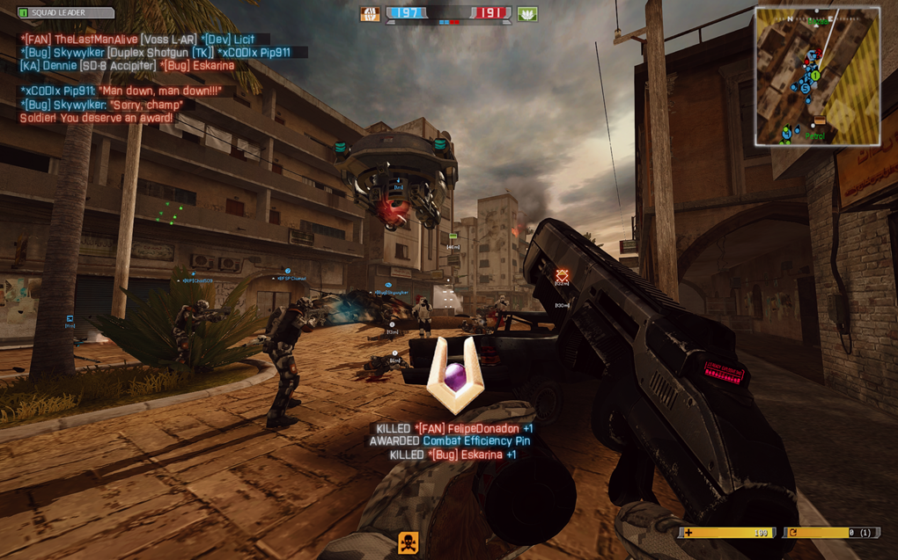
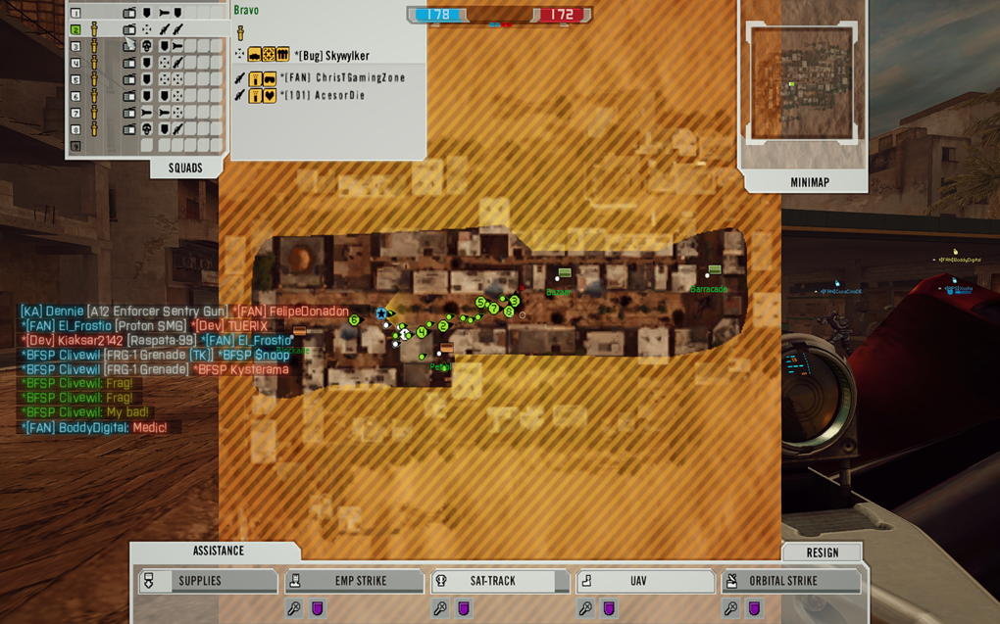

# Frostbite Chat

A lot of Battlefield fans love the BF3/BF4-style chat — it really adds a modern feel to the game and makes chatting more enjoyable. Now, we’re bringing that same great chat experience to BF2142, so everyone can enjoy the sleek, updated chat right here in 2142!



<figure><figcaption>
Player View
</figcaption></figure>



<figure><figcaption>
Commander View
</figcaption></figure>



### Preparations

* Do you know where your game directory is? It’s the folder with `BF2142.exe` and your `mods` — by default, usually at `C:\Program Files (x86)\Electronic Arts\Battlefield 2142`.
* If you want the changes for vanilla BF2142, edit the file in `\mods\bf2142`. For a specific mod, edit the file in that mod’s folder instead.
* Before installing this addon, make sure you’ve already installed the [Widescreen Hudfix](hudfix.md) for your chosen mod. If you’re using the Remaster mod, enable the <mark style="color:blue;">HUD-fix</mark> option in the <mark style="color:blue;">Remaster Launcher</mark> before adding this addon.

### Procedures



Download the patch from [Downloads](frostbite-chat.md#downloads).



Follow the steps in the `README.txt` file to install the addons.



If you have any questions or run into any issues, feel free to join our [Discord](https://discord.gg/DaMVNknVnV) server.



### Downloads



**BF2142 Frostbite Chat Addon v2 (6.5 MB)**





**BF2142 Frostbite Chat Addon v2 - No Chat Background (6.5 MB)**







**v2**

* Ported from the BF2 HOB mod instead of the BF2 Frostbite MenuShader to support HD fonts
* Added a background to the chat list
* Added support for personal messages (displayed at the middle bottom of the screen)
* Added support for chat in the Commander screen
* Tweaked the J, K, and L texts in the input box



### Remarks

* Revert your changes before joining Reclamation or any multiplayer servers, unless the server explicitly allows or uses this mod.
* If you host a server with this tweak, players who join will also need to make this change.
* To uninstall the fix, simply undo the changes you made.

### Acknowledgements

Special thanks to:

* [Leeberty](https://www.moddb.com/members/leeberty) for making BF3 Chat and Nametags possible in BF2 @ [Frostbite MenuShader](https://www.moddb.com/mods/frostbite-menushader), [Frostbite Nametags](https://www.moddb.com/mods/frostbite-nametags-for-battlefield2)
* Heat of Battle Team for further enhancing the HUDs made by Leeberty @ [Heat of Battle](https://www.moddb.com/mods/heat-of-battle2)
* Dennie for porting this enhancement for BF2142 @ [BF2142 Remastered](https://discord.com/invite/nVdDkgA)
