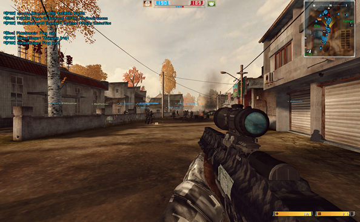
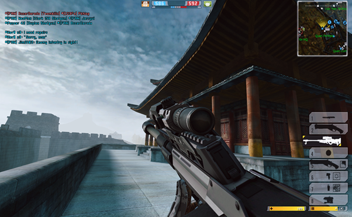

# Maps with Bots

If you’re a Battlefield fan who loves playing with bots, you’ve probably noticed that the standard map selection can get old fast. A lot of us wish there were more vanilla maps with bot support — or even the chance to play classic BF2 or 1942 maps in BF2142.

Maybe you’re looking for maps loaded with vehicles, or ones designed just for epic walker or tank battles. In this guide, I’ll show you where to find these custom maps and share some top recommendations to help you build the ultimate collection.

<figure><figcaption>
Victory Village
</figcaption></figure> <figure><figcaption>
Operation Amos
</figcaption></figure> <figure><figcaption>
Wall of Jericho
</figcaption></figure> <figure><figcaption>
Sharqi Peninsula
</figcaption></figure>

### Vanilla BF2142

You got just 5 maps with bot support for singleplayer and multiplayer.

Map List

* Belgrade - 16

- Cerbere Landing - 16

* Fall of Berlin - 16

- Suez Canal - 16

* Verdun - 16

### Project Remaster

You'll get a long list of maps with bot support for both singleplayer and multiplayer.

You’ll get smarter AI, upgraded textures, and better balancing tweaks on these maps.&#x20;

You’ll also find bot support added to more vanilla maps, plus support for different map sizes and layouts. There’s even partial bot support for the Titan map in the 48-player layout.

Map List

#### Core Maps

* Belgrade - 16/32/64
* Cerbere Landing - 16/32/64
* Fall of Berlin - 16/32
* Suez Canal - 16/32/48/64
* Verdun - 16/32/48/64
* Minsk - 16/32/48/64
* Tunis Harbor - 16/32/64
* Camp Gibraltar - 16/32/64
* Shuhia Taiba - 16/32/48/64
* Sidi Power Plant - 16/32/48/64
* \[BF2] Highway Tampa - 16/32/48/64 \[...[^1]]

#### v1.50 Maps

* \[BF2] Wake Island 2142 - 64 \[...][^2]
* Operation Shingle - 16/32/64

#### v1.51 Maps

* Molokai - 16/32/64
* Yellow Knife - 16/32/64
* \[BF2] Operation Blue Pearl - 16/32/64 \[...[^3]]
* \[BF2] Strike at Karkand - 16/32/48/64 \[...[^4]]

#### Northern Strike Maps

* Bridge at Remagen - 16/32/64
* Leipzig - 16/32/64
* Port Bavaria Day - 16/32/64 \[...[^5]]
* Port Bavaria Night - 16/32/64 \[...[^5]]
* Breakthrough at Remagen - 16/32/64 \[...[^6]]

#### Custom Maps

* \[BF2] Backstab - 16/32/64 \[...[^7]]
* Test Range - 16 \[...[^8]]

Interested? Click [here](../project-remaster/install-project-remaster.md) to download and install the mod.

### BF2142 Hub

From the many maps available in the Reclamation Map Pack, only a handful support bots.

If you’re looking to play new maps with bots in singleplayer or multiplayer, here are some recommendations to get you started.

Map List

Click [here](https://www.battlefield2142.co/maps/v3.html) for more details about the maps in the pack.

#### Core Maps (with \_coop suffix)

* Belgrade
* Camp Gibraltar
* Cerbere Landing
* Fall of Berlin
* Highway Tampa
* Liberation of Leipzig

- Operation Shingle
- Shuhia Taiba
- Sidi Power Plant
- Suez Canal
- Verdun
- Minsk
- Hamburg Harbour - 16/32

#### Custom Maps

* Desert Storm - 16

- German Camp - 64

* \[BF1942] Kursk - 16

- Severnaya - 16

* \[BF2] Street - 16
* 2142 Shipment - 16

#### Broken Maps (broken bot support)

* \[BF2] tgw operation amos - 16

- \[BF2] tgw sharqi peninsula - 16

* \[BF Heroes] Victory Village - 16

- \[BF2] Wall of Jericho (Great Wall) - 32/64

Check out [this guide](../../getting-started/install-map-pack.md#installing-individual-maps) to learn how to install individual maps instead of downloading the entire pack.

### ModDB

Most working maps on ModDB are included in the Reclamation Map Pack, but there are two new maps not in the pack that are worth trying. There's a partial bot support for the Titan map in the 48-player layout.

Map List

* Close Encounter - 16/32/48/64

- Frosty Peaks - 64




Source: [zynthasius](https://www.moddb.com/members/zynthasius) @ [ModDB](https://www.moddb.com/)





Source: [zynthasius](https://www.moddb.com/members/zynthasius) @ [ModDB](https://www.moddb.com/)




### GetBF2142

You’ll get a few maps from the Reclamation Map Pack that we’ve fixed or tweaked for a better experience. These maps are mostly custom maps or maps from another Battlefield series.

Just a heads up: this version isn’t compatible with Reclamation servers.

Map List

* Street - 16 \[BF2]
* Desert Storm - 16
* Victory Village - 16 \[BF Heroes]
* Sharqi Peninsula - 16 \[BF2]
* Operation Amos - 16 \[BF2]
* Wall of Jericho (Great Wall) - 32/64 \[BF2]


To install the map, extract the files to `...\Battlefield 2142\mods\<MOD>\Levels`. **\[**[**?**](#user-content-fn-9)[^9]**]**




Street is a BF2 community map by spfreak that’s now been ported to BF2142 with solid bot support, making it a blast to play. Set in a Middle Eastern town, the map features a linear layout of control points and plenty of urban cover for intense street battles.



#### **What's changed ?**

* The ghost car (a broken object that could get players stuck) has been removed.
* Control points and spawn points have been renamed for clarity.

#### Acknowledgements

* Full credit goes to spfreak and TGW for porting the map from BF2 to BF2142.
* You can find the original version in the Reclamation Map Pack.



Set in a wide-open desert, Desert Storm gives off strong BF1 Sinai Desert vibes right from the start. Every control point is packed with vehicles, making it perfect for large-scale tank and walker battles. With solid bot support, this custom map is a lot of fun to play on.



#### What's changed ?

* The sky brightness and color saturation have been fixed, giving the map a more Belgrade-like atmosphere that’s much easier on the eyes.
* Vehicle spawns have been adjusted — now you’ll see more walkers, tanks, and AGs, so most of your bots can hop into a vehicle and join the action.

#### Acknowledgements

* Full credit goes to Jeff & Robin (if I’m not mistaken), the creators of the map.
* You can find the original version in the Reclamation Map Pack.



Victory Village is a well-known map from Battlefield: Heroes, now adapted to work in vanilla BF2142 with decent bot support. While it’s playable, there are still a few quirks.

Originally, [Victory Village 2142](https://www.moddb.com/games/battlefield-2142/addons/na16686) with bot support was released by [yone](https://www.moddb.com/members/yone) on ModDB, but it often crashed on newer versions of the game. Later, [matthysjordaan](https://www.moddb.com/members/matthysjordaan) published [Victory Village (Fixed)](https://www.moddb.com/addons/victory-village-fixed), which loads properly but dropped bot support. We’ve combined both versions and added our own tweaks to bring this map back for Conquest Coop.



#### What's changed?

* Bot support has been restored.
* Buggy spawn points that caused bots to die instantly have been removed.
* Unnecessary load files / dependencies have been cleaned up.
* Both team bases are now uncapturable, and the three central control points start neutral.

#### Acknowledgements

* Full credit goes to [yone](https://www.moddb.com/members/yone) and [matthysjordaan](https://www.moddb.com/members/matthysjordaan) for porting the map from BFHeroes to BF2142.
* The original versions are available on ModDB and in the Reclamation Map Pack.



Sharqi Peninsula is a classic Middle Eastern map from Battlefield 2, known for its iconic construction site control point. Now, it’s been ported to BF2142 with fixes to make bot support playable.



#### What’s changed ?

* The crash when loading into singleplayer or co-op has been fixed by swapping out BF2 vehicles for BF2142 alternatives.
* The sky lighting has been adjusted, so the map no longer looks overly dark.

Keep in mind, bot support is still a bit buggy — bots can struggle with stairs at the final control point — but the map is definitely playable.

#### Acknowledgements

* Full credit goes to TGW for porting the map from BF2 to BF2142.
* You can find the original version in the Reclamation Map Pack.



Operation Amos is a popular Chinese map from Battlefield 2, now ported to BF2142 with improvements for playable bot support.



#### What's changed ?

* The crash when loading into singleplayer or co-op has been fixed by swapping out BF2 vehicles for BF2142 alternatives.
* The broken bridges between the middle control points have been repaired, so bots no longer get stuck in the water and can return to land.

Keep in mind, bot support is still a bit buggy — bots can struggle with vehicle use at the final control point — but the map is definitely playable.

#### Acknowledgements

* Full credit goes to BF:A Ha-Knomboe Boy and TGW for porting the map from BF2 to BF2142.
* You can find the original version in the Reclamation Map Pack.



Wall of Jericho, known as Great Wall in BF2, is a classic Battlefield map set in China.



#### What's changed ?

* The crash when loading into singleplayer or co-op has been fixed by swapping out BF2 vehicles for BF2142 alternatives.
* Bot support has been added by bringing over AI and pathfinding files from the original BF2 version.

Since the map features a walled city, bots aren’t always smart enough to find their way in or out, so they can get stuck inside. Bot support is just okay, but the map is still playable — and it’s a great spot for taking screenshots with your favorite rifles!

#### Acknowledgements

* Full credit goes to TGW for porting the map from BF2 to BF2142.
* You can find the original version in the Reclamation Map Pack.



[^1]: Highway Tampa is a remake of its Battlefield 2 version. The map mostly retains the original layout but is recreated with BF2142 objects throughout.

[^2]: Wake Island 2142 is a community map based around the continuation of Wake Island map variants in the Battlefield series.

[^3]: Operation Blue Pearl is a remake of its Battlefield 2 version. The map mostly retains the original layout but is recreated with BF2142 objects throughout.

[^4]: Strike at Karkand a remake of its Battlefield 2 version, featuring mostly native BF2 objects along with some BF2142 elements.

[^5]: Port Bavaria comes in both Day and Night versions.

[^6]: Breakthrough at Remagen is a variant of Bridge at Remagen.

[^7]: Backstab is a remake of the BF2MC Backstab map, keeping the original layout but rebuilt with BF2142 objects.

[^8]: Test Range, originally called The Hell, is a map from the Reclamation Map Pack that’s been included just for testing purposes.

[^9]: `...` is usually `C:\Program Files (x86)\Electronic Arts\Battlefield 2142`, though this may vary depending on your setup.
