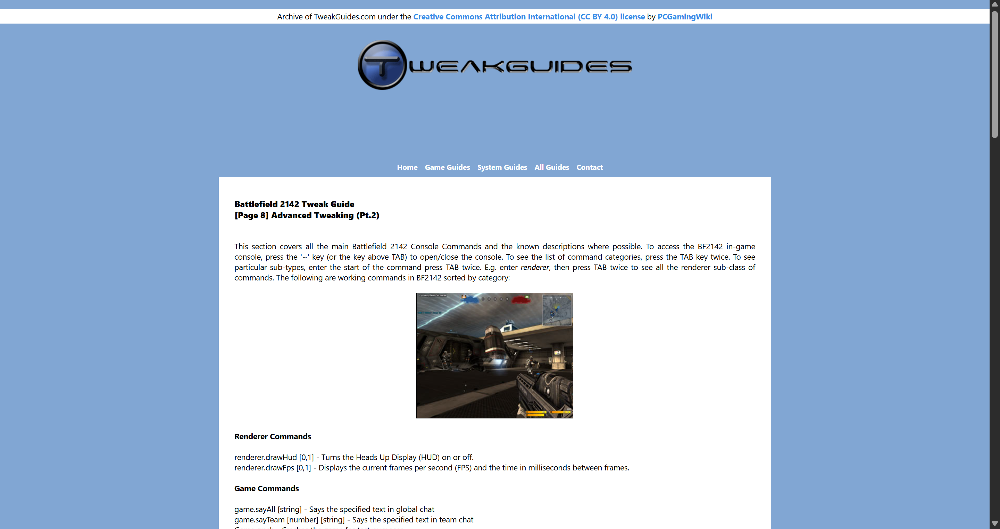
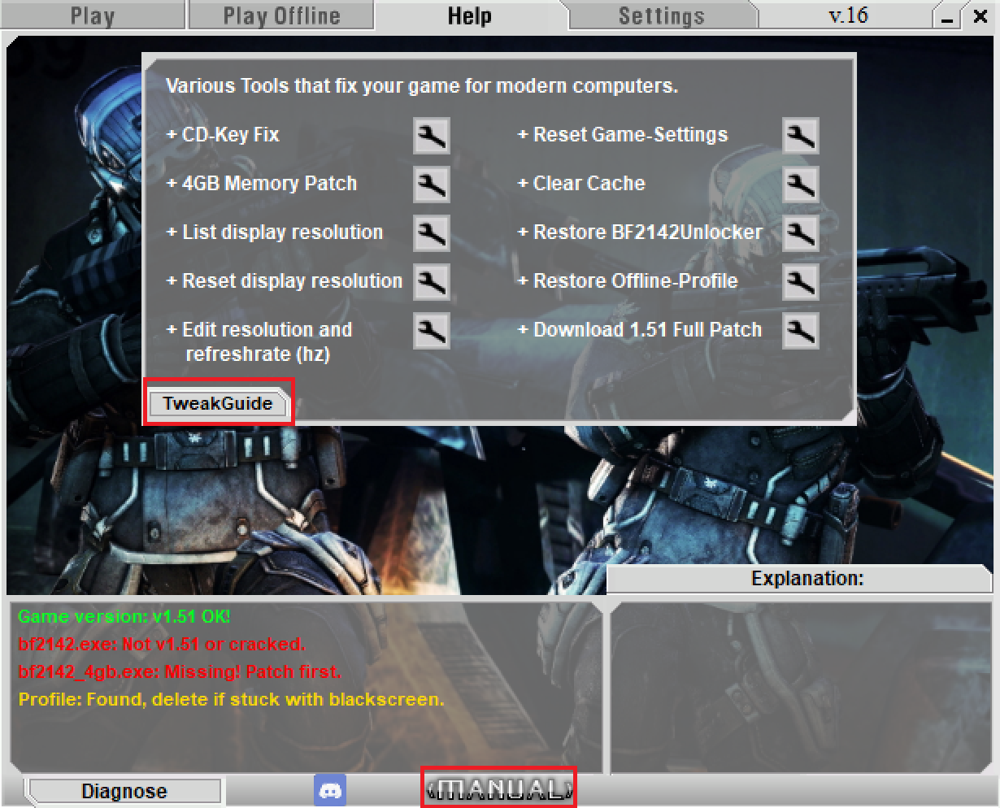

# Further Readings

Remaster Manual and [Tweak Guide](https://tweakguides.dmegaming.com/BF2142_1.html) are full of helpful info about the game and the mod, so we definitely recommend setting aside a bit of time to check them out.

<figure><figcaption>
Remaster Manual
</figcaption></figure>

<figure><figcaption>
Tweak Guide
</figcaption></figure>

These materials are great resources if you want to dive deeper into the game. They come built right into the mod — just install the [Remaster](install-project-remaster.md) mod and use the launcher buttons to access them.

<figure><figcaption>
Remaster Launcher
</figcaption></figure>

You can still check out the the [Tweak Guide](https://tweakguides.dmegaming.com/BF2142_1.html) online. The latest Remaster Manual comes only with the mod, but we have an [older PDF version](https://drive.google.com/file/d/1VuFEuFK6_I_iWIEhWMc9cyEC4zq4gQCg/view?usp=sharing) (v14 BETA 10 2021) here for your reference.

Enjoy exploring the wiki! See you on the battlefield!
