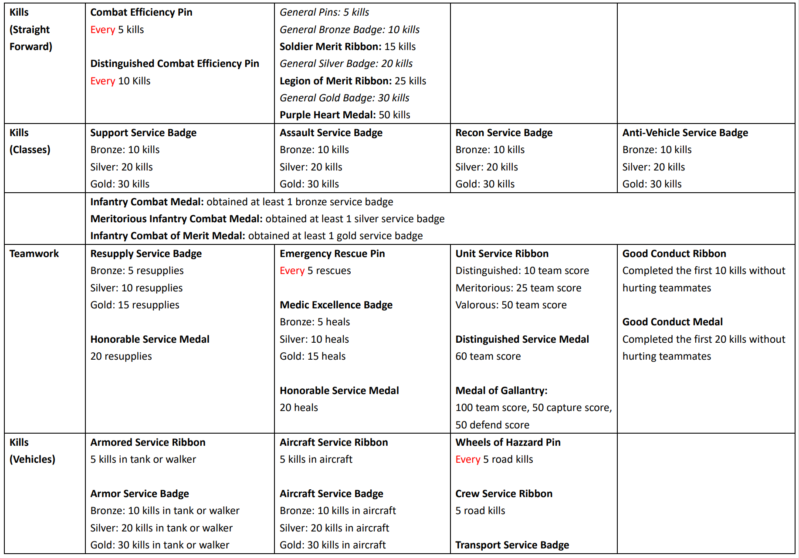
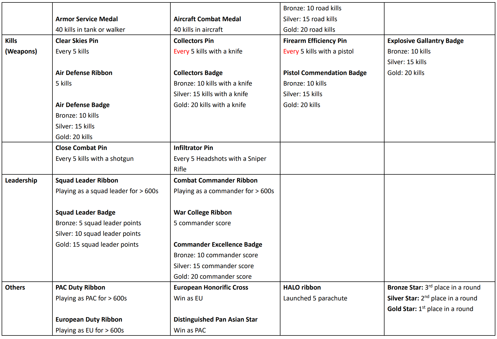

# Installing Offline Rewards Patch

What the patch does is to emulate the ranked server's rewards system (pin, ribbons, badges, medals) in your single-player or LAN's coop mode games. But keep in mind that it's just a simulation. The rewards will only last for a round and will be gone once the game ends.

But it's still a very good QoL enhancement. It makes bots grinding a much more enjoyable thing.

The problem is that you're not really getting any medals or badges if things work in vanilla standard. Remember the rewards will be reset after every round? But many rewards require something like "**150 Total Hours Played**" or "**300 Wins EU Team**", something that isn't possible to achieve in just a single round. So we've revamped the whole rewards system so that it's much more compatible with coop games.

* Removing rewards related to Titan mode.
* Removing requirements that are impossible to achieve.
* Simplified the requirements of many rewards.
* Follows the hierarchy of `Pins < Ribbons < Badges < Medals`.
* Most of the rewards can be obtained in a 15mins game, preferably > 25mins.
* A few rewards may not work properly due to PR's new weapons name.

## Procedures


You are strongly advised to backup the original python folder first before proceeding to install this patch.


1. Download "**`offline_rewards.zip`**".
2. Unzip the file and then drag and drop the python folder into the root directory of the game folder, which is "**`/Battlefield 2142/`** "
3. Click "**Replace All**" if files need to be overwritten.

## Downloads



offline\_rewards.zip (Google Drive, 42KB)


SouSource: GetBF2142.net \[[Contact us](https://getbf2142.weebly.com/contact.html) if the link is broken.]&#x20;




## Content

