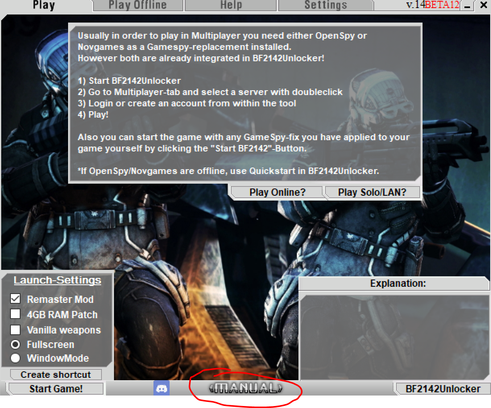

# Further Readings

Project Remaster's Wiki includes other crucial details about the game, so we strongly recommend taking the time to read through their materials.

<figure><figcaption>
Source: <a href="https://discord.gg/nVdDkgA">Project Remaster Discord</a> [Last Checked on Dec 2023]
</figcaption></figure>

As you can see, the wiki has a great layout and is very well-written, so you shouldn't miss this excellent resource to learn more about the game. The wiki is a built-in feature of Project Remaster, which means all you have to do is install Project Remaster and click the Manual button located at the bottom of the launcher to launch the offline wiki.

<figure><figcaption>
Source: <a href="https://discord.gg/nVdDkgA">Project Remaster Discord</a> [Last Checked on Dec 2023]
</figcaption></figure>

Enjoy exploring the wiki!
