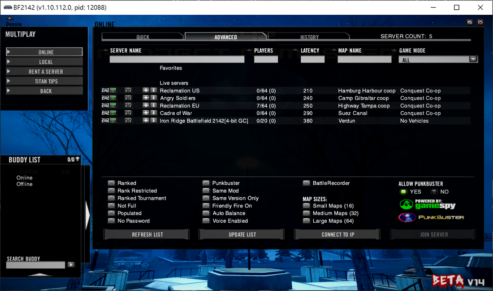

# ④ Install OpenSpy Patches

In this tutorial, we’ll focus on getting your game working with OpenSpy. If you have any questions or run into any issues, don’t hesitate to join our [Discord](https://discord.gg/DaMVNknVnV) server — we’re always happy to help!

What is OpenSpy ?

OpenSpy is an open-source replacement for GameSpy, designed to provide full compatibility with GameSpy-supported games. The Reclamation community is the main BF2142 group using the OpenSpy master server.

What is a master server ?

A master server manages your login credentials and soldier data, broadcasts available game servers to your server browser, and receives regular updates from game servers about player progress. OpenSpy is a great example of a Master Server that provides online services for games like Battlefield 2142.

Why do we need OpenSpy patches ?

After [GameSpy shutdown](https://en.wikipedia.org/wiki/GameSpy#Shutdown) in 2014, the original online services for BF2142 stopped working. OpenSpy patches redirect the game to use the OpenSpy master server instead, letting you log in and play online again.

Are there any other master servers besides OpenSpy ?

Yes, there are a few, like NovGames, PlayBF2142, and MAGMA. However, OpenSpy — especially with the Reclamation community — offers the most reliable and active service. You can easily switch between OpenSpy and NovGames using BF2142 Hub.

What is Project Reclamation? How is it related to OpenSpy ?

Project Reclamation is a community effort that brings Battlefield 2142’s online features back to life. It uses the OpenSpy platform to recreate the master server experience that GameSpy originally provided. Reclamation servers connect directly to the OpenSpy master server, so you can easily find and join games — just like you could back in the day.

How is the Reclamation community doing ? Is it still active ?

<figure><figcaption></figcaption></figure>

The Reclamation community is still going strong! There are both EU and US servers, and the community is English-speaking and active on the [Reclamation Discord](https://discord.com/invite/MEwBW9U).

Reclamation EU usually hits its peak population starting around 6PM GMT, while Reclamation US gets busy around 12AM GMT. Weekends tend to be even more active than weekdays during these times. **\[**[**?**](#user-content-fn-1)[^1]**]**

You can enjoy various game modes, including Conquest, Conquest Coop, and Titan. **\[**[**?**](#user-content-fn-2)[^2]**]**

To join:

* Make sure you’ve installed OpenSpy patches using BF2142 Hub.
* Also, install the Reclamation Map Pack (or any maps currently running on the server) through BF2142 Hub.

Jump in and you’ll find a welcoming and active community!

Do we get all the unlocks with OpenSpy - Reclamation ?

Yes, connecting to OpenSpy is a real privilege — all unlocks are available to everyone as soon as you create a new soldier. As long as you're connected to the internet, you'll have access to all unlocks in Single-Player and LAN modes. This makes it perfect for grinding against bots in a Conquest Coop game.

## Procedures


Before patching your game, it’s a good idea to make backup copies of your `BF2142.exe` and `RendDX9.dll` files from your game folder. \[Why?[^3]]



BF2142 Hub is a 64-bit application and won’t run on 32-bit Windows XP. If you’re using Windows XP, check out [this guide](https://battlefield2142.co/faq#notwin32) for alternative steps you can take.




Right-click <mark style="color:blue;">BF2142 Hub</mark> shortcut on your desktop and select <mark style="color:blue;">Properties</mark>.&#x20;



Go to the <mark style="color:blue;">Compatibility</mark> tab, check <mark style="color:blue;">Run this program as an administrator</mark>, then click <mark style="color:blue;">Apply</mark> and <mark style="color:blue;">OK</mark>. **\[**[**?**](#user-content-fn-4)[^4]**]**



Double-click the shortcut to launch BF2142 Hub.



When prompted by [<mark style="color:blue;">User Account Contro</mark>](#user-content-fn-5)[^5]<mark style="color:blue;">l</mark>, click <mark style="color:blue;">Yes</mark> to allow the app to make changes on your device.



Go to the <mark style="color:blue;">Help</mark> tab (the question mark icon) and check if the <mark style="color:blue;">GamePath</mark> is set to the correct folder. If it isn't, click the gear icon to locate your game folder.



From the <mark style="color:blue;">Redirects\*</mark> drop-down menu, select <mark style="color:blue;">OpenSpy</mark> and click <mark style="color:blue;">Install</mark>.



When asked <mark style="color:blue;">Are you sure you want to patch the game?</mark>, click <mark style="color:blue;">Yes</mark> .



Once you see <mark style="color:blue;">Patch completed, Enjoy!</mark>, click <mark style="color:blue;">Confirm</mark>.



After patching, make sure the checkmarks for `Patch 1.51`, `BF2142.exe`, `RendDX9.d`, `RendDX9ori.dll` are all <mark style="color:green;">green</mark>. If any aren't, repeat from step 6.



If you run into issues like crashes, the game not starting, or graphics glitches, the troubleshooting and diagnosis tools on the <mark style="color:blue;">Help</mark> tab are very useful.



If you’re using Windows display scaling, you might run into scaling issues when launching the game in windowed mode **\[**[**?**](#user-content-fn-6)[^6]**]**. You can fix this by running the game in compatibility mode:

1. Go to the folder where your `BF2142.exe` is located — by default, that’s usually `C:\Program Files (x86)\Electronic Arts\Battlefield 2142`.
2. Right-click `BF2142.exe` and select <mark style="color:blue;">Properties</mark>.
3. In the <mark style="color:blue;">Compatibility</mark> tab, click <mark style="color:blue;">Change high DPI settings</mark>.
4. Under <mark style="color:blue;">High DPI scaling override</mark>, check <mark style="color:blue;">Override high DPI scaling behavior</mark> and set <mark style="color:blue;">Scaling performed by:</mark> to <mark style="color:blue;">Application</mark>.
5. Click <mark style="color:blue;">Apply</mark> and <mark style="color:blue;">OK</mark>.

Just a heads up: you’ll need to repeat these steps every time you click the install button in BF2142 Hub. **\[**[**?**](#user-content-fn-7)[^7]**]**



## Reclamation Map Pack

The Reclamation Community runs 2 multiplayer servers, both featuring their own modified versions of maps. To join their public servers, you’ll need to install their map pack or the specific map currently in rotation. Click [here](https://www.battlefield2142.co/maps/v3.html) for more details about the maps in the pack.

Is it mandatory to download this pack ?

No, the pack only needed if you want to play on Reclamation servers.

Can I download the maps individually ?

Yes, you can download the maps individually without downloading the entire pack.

Where are the maps installed ?

The maps are automatically installed to the `\mods\bf2142\Levels` folder.

#### **Installing the complete pack**



In the <mark style="color:blue;">Download</mark> tab, double-click on <mark style="color:blue;">BF2142 MapPack v1.0</mark>.



This will open your browser to the download link of the pack.

Download `ReclamationMapPack.zip` (ModDB, 5.41 GB) or from [here](https://www.moddb.com/games/battlefield-2142/downloads/bf2142-reclamation-map-pack-march-21st-2025).



Once the download finishes, click the <mark style="color:blue;">MapPack Installer \*</mark> button and select the `.zip` file you just downloaded.



A command-line window will appear and close automatically when the installation is done.



If everything looks good, you can close the app.



#### **Installing individual maps**



In the <mark style="color:blue;">Download</mark> tab, click on <mark style="color:blue;">Individual Maps</mark>.&#x20;



Choose the maps you want to download from the <mark style="color:blue;">Available Maps</mark> box and click <mark style="color:blue;">>></mark> to download them.



To uninstall a map, select it from the <mark style="color:blue;">Installed Maps</mark> box and click <mark style="color:blue;"><<</mark>.



[^1]: You’ll usually find 10+ players on weekdays and 30+ on weekends.

[^2]: Reclamation servers use auto-managing scripts that adjust maps and game modes based on how many players are online. Titan matches won’t be enabled until there are at least 20 players in the server.

[^3]: This way, you’ll have a safety net in case anything goes wrong during the patching process.

[^4]: Running as administrator helps prevent permission issues during patching.

[^5]: i.e., Do you want to allow this app from an unknown publisher to make changes to your device?

[^6]: Sometimes, Windows scaling settings can clash with a game’s display settings, which may cause incorrect scaling or visual glitches.

[^7]: Whenever you install a new patch from BF2142 Hub, it updates your `BF2142.exe`, which means your compatibility settings will be reset.
