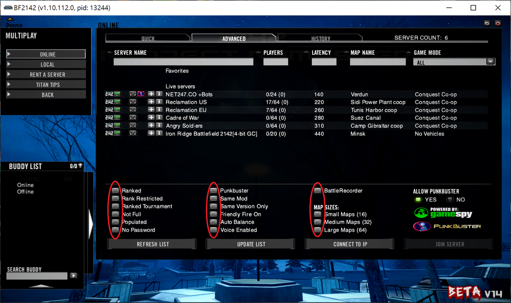

# ⍟ Play Multiplayer

In this tutorial, we'll walk you through the steps to join a server.

A few things to keep in mind ...

* If you’re joining Reclamation servers or any _pure_ vanilla servers, make sure you’re using a vanilla BF2142 setup — don’t use any addons like Blood Patch or HUD-Fix that change files in `mods\bf2142`.

- You can only join servers that match the mod and files you have.
  * You can’t join a vanilla server with a mod enabled, or the other way around.
  * To join a modded server, you’ll need to have the exact same mod and files installed as the server.


{% column width="41.66666666666667%" %}
<figure><figcaption></figcaption></figure>



The green icon next to the 2142 icon shows if a server is modded or not — green means it’s vanilla, while red means it’s running a mod. To join servers with the green icon, always launch the game without any mods enabled or files modified. **\[**[**?**](#user-content-fn-1)[^1]**]**

To join a Reclamation server, you’ll need to install their [custom maps](apply-openspy-patches.md#reclamation-map-pack). **\[**[**?**](#user-content-fn-2)[^2]**]**



## Joining a LAN Server

A local server is a game server that shows up in your local server browser and can be accessed by anyone on your LAN network.



Select <mark style="color:blue;">MULTIPLAY</mark> → <mark style="color:blue;">LOCAL</mark>.



In the <mark style="color:blue;">JOIN</mark> tab, click <mark style="color:blue;">UPDATE LIST</mark> until the LAN server appears.



​Once it shows up, double-click the server to join.



Solution to "Server Not Found" issue in local server browser

First, make sure you’re connected to the same LAN network as the server host. If you still can’t find the server in the local server browser, even when it’s running, try this:

1. Click <mark style="color:blue;">ONLINE</mark> in the game.
2. Go to the <mark style="color:blue;">ADVANCED</mark> tab and click <mark style="color:blue;">CONNECT TO IP</mark>.
3. Enter the server’s local IP address (usually something like `192.168.x.x`) and click <mark style="color:blue;">OK</mark>. The server host can find their local IP on the loading screen after launching the server.

#### **Why does this happen?**

Often, it’s because your PC has multiple network adapters — especially if you use programs like Hamachi, VirtualBox, or VMWare.

#### **The simplest fix**

Disable all other network adapters except the one you’re using for your current network.

1. Go to <mark style="color:blue;">Network and Sharing Center</mark> in your <mark style="color:blue;">Control Panel</mark>.

2) Click <mark style="color:blue;">Change adapter settings</mark>.
3) Right-click any adapter you want to disable and select <mark style="color:blue;">Disable</mark>.

Do this first on the server computer, then on any computers trying to connect. This should help your LAN server show up in the local server browser!

Reference: [https://superuser.com/questions/610733/networking-games-cant-see-join-anyone-elses-lan-servers-unless-i-host](https://superuser.com/questions/610733/networking-games-cant-see-join-anyone-elses-lan-servers-unless-i-host)

## Joining a Public WAN Server

A public server is a game server that shows up in the online server browser and can be accessed over the Internet.



Click <mark style="color:blue;">MULTIPLAY</mark> → <mark style="color:blue;">ONLINE</mark>.



In the <mark style="color:blue;">ADVANCED</mark> tab, uncheck all the filter options and click <mark style="color:blue;">UPDATE LIST</mark>. **\[**[**?**](#user-content-fn-3)[^3]**]**

<figure><figcaption></figcaption></figure>




You should now see a list of public servers. Double-click one to jon and play.



## Joining a Private WAN Server

A private WAN server is a game server that doesn’t show up in the online server browser, but you can still access it over the internet if you have its public IP address.



Click <mark style="color:blue;">MULTIPLAY</mark> → <mark style="color:blue;">ONLINE</mark>.



In the <mark style="color:blue;">ADVANCED</mark> tab, click <mark style="color:blue;">CONNECT TO IP</mark>.



Enter the server's public IP address and adjust the [port number](#user-content-fn-4)[^4] if needed.



Click <mark style="color:blue;">OK</mark> to connect.



[^1]: If you don’t, you’ll see a message saying “this server is running a different mod” and you won’t be able to join.

[^2]: If you don’t, you’ll see a message saying “this map contains customized content” and you won’t be able to join.

[^3]: If you don't, you'll see no multiplayer servers showing up in the list.

[^4]: 17567 is the default port.
